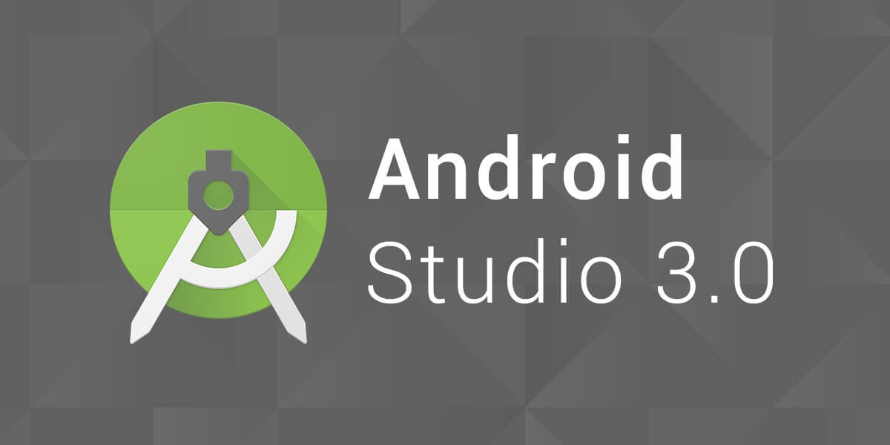

## Introduce My Self
@snap[south-east]
#### Changhun Song
@snapend

---
@snap[north-west]
## Programming Language
@snapend
@snap[west]
@ul[squares]

- Python
- C, C++
- Java
- Ocaml

@ulend

@snapend

---
@snap[north-west]
## Development Engine
@snapend
@snap[west span-30]

@snapend
@snap[midpoint span-30]

@snapend
@snap[east span-30]

@snapend

---
@snap[north-west]
## Projects
@snapend

@snap[west span-60]
The arrival of @size[1.2em](New Woman)
@size[1.6em](@color[orange](Guide)) Application
@snapend
@snap[south-west]
@size[0.5em](@color[gray](National Modern Art Museum))

@snapend

@snap[east span-40]

@snapend

---?color=#E58537
@title[Add A Little Imagination]

@snap[north-west]
#### Add a splash of @color[cyan](**color**) and you are ready to start presenting...
@snapend

@snap[west span-55]
@ul[spaced text-white]
- You will be amazed
- What you can achieve
- *With a little imagination...*
- And **GitPitch Markdown**
@ulend
@snapend

@snap[east span-45]
@img[shadow](assets/img/conference.png)
@snapend

---?image=assets/img/presenter.jpg

@snap[north span-100 headline]
## Now It's Your Turn
@snapend

@snap[south span-100 text-06]
[Click here to jump straight into the interactive feature guides in the GitPitch Docs @fa[external-link]](https://gitpitch.com/docs/getting-started/tutorial/)
@snapend
