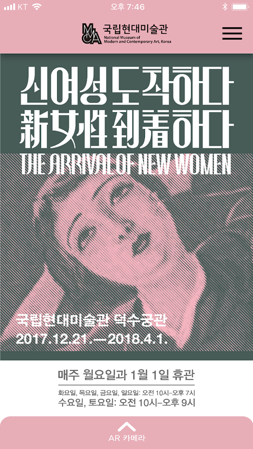

## Introduce My Self
@snap[south-east]
#### Changhun Song
@snapend

---
@snap[north-west]
## Programming Language
@snapend
@snap[west]
@ul[squares]

- Python
- C, C++
- Java
- Ocaml

@ulend

@snapend

---
@snap[north-west]
## Development Engine
@snapend
@snap[west span-30]

@snapend
@snap[midpoint span-30]

@snapend
@snap[east span-30]

@snapend

---
@snap[north-west]
## Projects
@snapend

@snap[west span-60]
The arrival of @size[1.2em](New Woman)
@size[1.6em](@color[orange](Guide)) Application
@snapend
@snap[south-west]
@size[0.5em](@color[gray](National Modern Art Museum))

@snapend

@snap[east span-40]

@snapend

---
@snap[north-west]
## Weakness
@snapend

@ul
- Web Development
- Testing and Validating
@ulend

---

# Thank You
